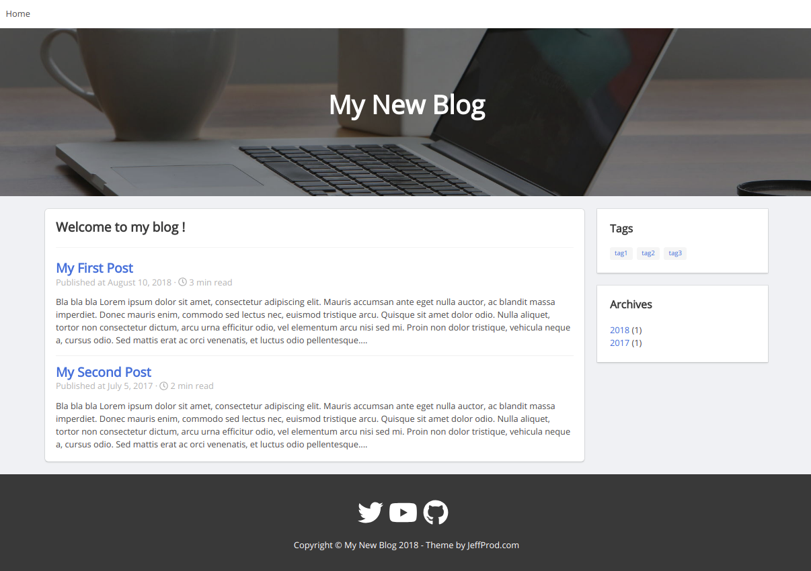

# WebShot

A free blog theme for [HUGO](https://gohugo.io/), with tags, archives, last posts...



# Install

Install HUGO (<https://gohugo.io/>) then :

```
hugo new site myblog
cd myblog
git clone https://github.com/Tazeg/hugo-blog-jeffprod.git themes/jeffprod
```
In the file `config.toml` add the lines :
```
theme = "jeffprod"

[permalinks]
    post = "/:year/:filename"

[taxonomies]
    tag = "tags"
    archive = "archives"
```

### Write blog posts

```
hugo new post/my-first-post.md
```
And edit this new file `content/post/my-first-post.md`.

### Render

```
hugo server
```
Then go to <http://localhost:1313>

### Create the web site

```
hugo
```

All files to publish are in `public/` directory.

# Donate

<https://en.jeffprod.com/donate.html>

# Credits

Background image by https://pixabay.com
